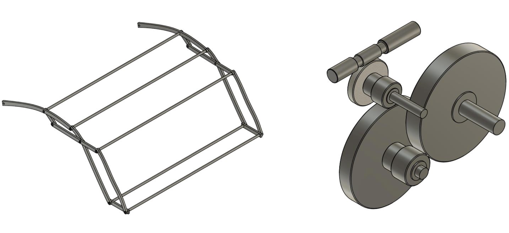

# Convertible roof mechanism design (Fiat 595 Abarth)

**A full mechatronic design of a powered convertible roof for the Fiat 595 Abarth, from the MATLAB motor and damping dynamics to a Fusion 360 assembly and Arduino safety sensors.**


University of Bristol Year 2 Engineering Practice group project. The brief was to design a working powered roof for the Fiat 595 Abarth and carry it the whole way: market research and concept selection in Linkage, the mechanism dynamics in MATLAB, CAD and FEA in Fusion 360, material selection in Edupack, and a set of Arduino safety sensors, finishing with a bill of materials and a design review.



## What's inside

### Roof dynamics (`basic_model.m` and variants)
The roof is modelled as a driven rotating mechanism turned by a brushed DC motor. An ODE45 solver integrates the roof angle and angular velocity across the deploy and retract cycles from a torque balance: the motor's torque-speed line, gravity, viscous damping, aerodynamic drag read from a lookup table (`aero.m`), and a centre-of-mass radius that changes through the motion, exported from the Linkage model (`radius.m`). From that it computes torque, power, and energy for each candidate gear ratio. The deploy cycle came out at roughly 647 J. `GRAPHSFORREPORT.m` collects the design iterations (constant radius, variable radius, and the aero-plus-damping variants) into the report figures.

### Safety electronics (`docs/mechatronics_code.ino`)
Four sensors guard the mechanism so it cannot close on something or run at speed. An ultrasonic sensor watches for an obstruction above the roof, a capacitive sensor detects an object in the path, an anemometer reads wind speed, and a Hall-effect sensor counts wheel rotations to infer vehicle speed. If any of them crosses its threshold the motor stops. Two PWM channels drive the deploy and retract directions.

### CAD, kinematics, and materials
The Fusion 360 roof and gearbox assembly with FEA, the Linkage models used for concept kinematics and concept selection, and the Edupack material-selection study behind the chosen metal.

## Tech stack

MATLAB (mechanism dynamics, power and energy) · Autodesk Fusion 360 (CAD, FEA) · Linkage (2D mechanism kinematics) · Arduino (safety sensor firmware) · Granta Edupack (material selection)

## Repository structure

```
convertible-roof-mechanism-design/
├── docs/
│   ├── fiat.png                     # Fiat 595 Abarth reference
│   ├── mechatronics_code.ino        # Arduino safety-sensor firmware
│   ├── Group 1a *.pdf               # design / technical / manufacturing / mechatronics reports
│   ├── 545 Graphs/                  # deploy + retract torque, power, energy plots
│   ├── Linkage/                     # concept kinematics + concept selection
│   └── Material Selection/          # Edupack indices + weighted matrix
└── src/
    ├── basic_model*.m               # roof dynamics (motor, gravity, damping, aero)
    ├── aero.m, damping.m, radius.m  # torque contributions + variable COM radius
    ├── GRAPHSFORREPORT.m            # report figures across design iterations
    └── *.f3d                        # Fusion 360 roof + gearbox CAD
```

## Notes

Group coursework project, shared as a portfolio reference. Please don't submit any of it as your own.
